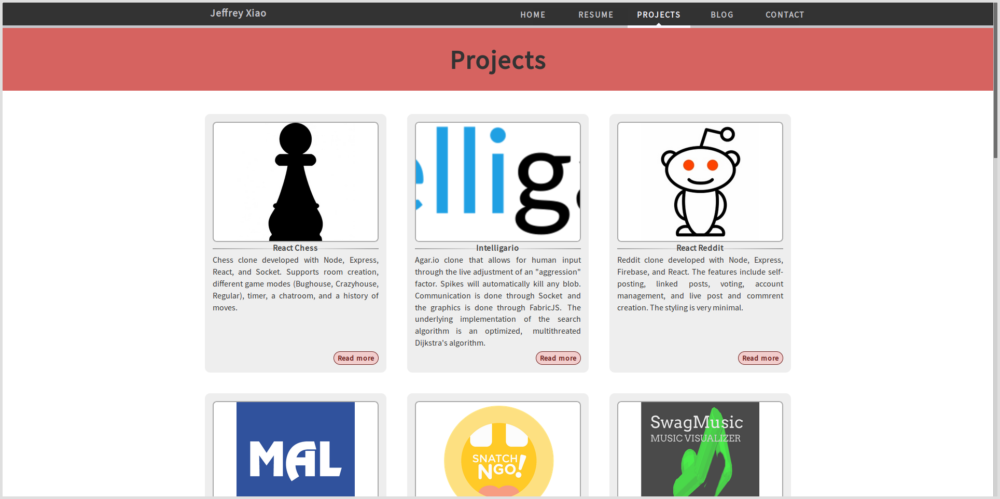

# personal-website-old

An old version of my personal website built with AngularJS 1, jQuery, and MathJax.

## License

`personal-website-old` is distributed under the terms of both the MIT License and the Apache License
(Version 2.0).

See [LICENSE-APACHE](LICENSE-APACHE) and [LICENSE-MIT](LICENSE-MIT) for more details.
